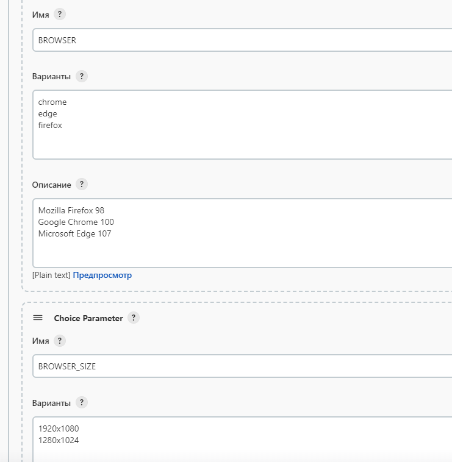
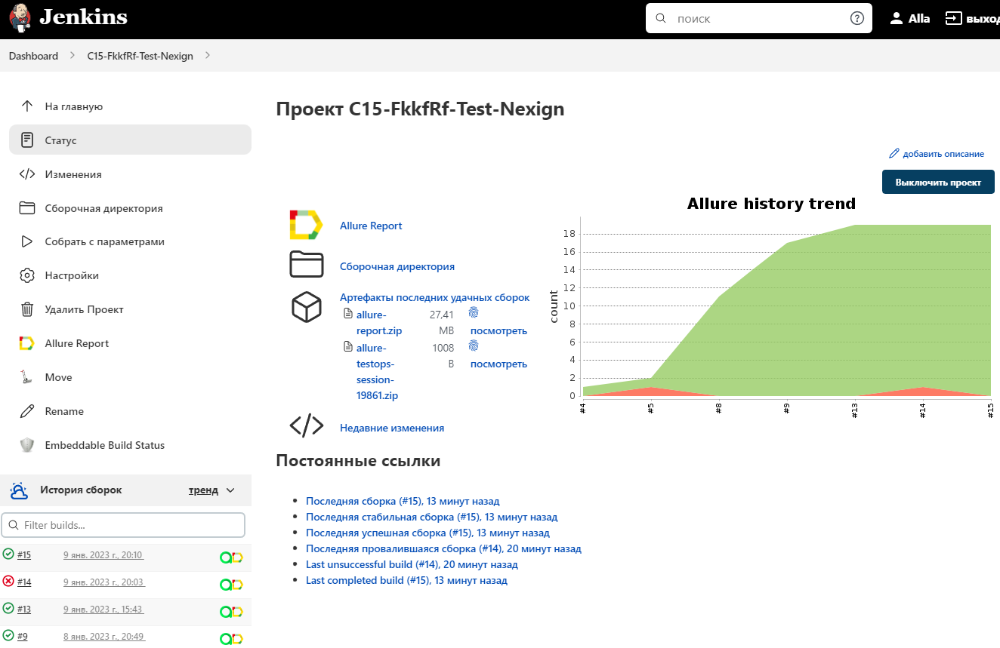
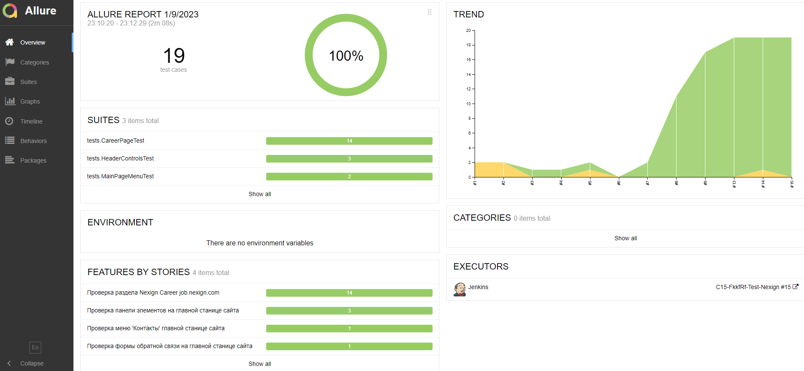
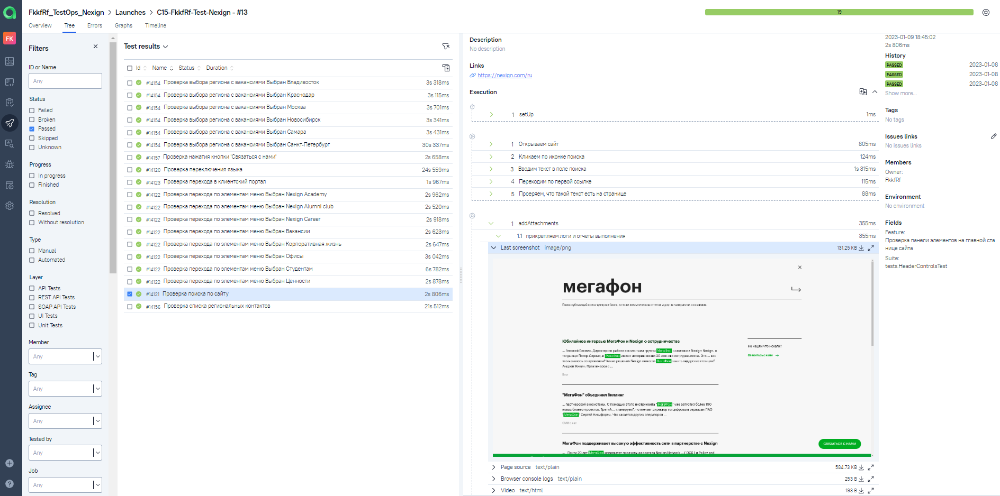
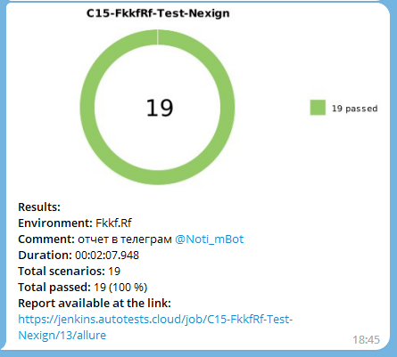

# Проект по автоматизации тестирования сайта компании Nexign

### <a target="_blank" href="https://nexign.com/ru">© АО «Нэксайн», 1992–2023</a>

# :green_book:	Содержание

> - [Технологии и инструменты](#battery-технологии-и-инструменты)
>
> - [Реализованы проверки](#chart-реализованы-проверки)
>
> - [Запуск тестов из терминала](#white_check_mark-запуск-тестов-из-терминала)
>
> - [Запуск тестов в Jenkins](#white_check_mark-запуск-тестов-в-Jenkins)
>
> - [Отчет о результатах тестирования в Allure Report](#white_check_mark-отчет-о-результатах-тестирования-в-allure-report)
>
> - [Интеграция с Allure TestOps](#white_check_mark-интеграция-с-allure-testops)
>
> - [Интеграция с Jira](#white_check_mark-интеграция-с-jira)
>
> - [Уведомления в Telegram с использованием бота](#white_check_mark-уведомления-в-telegram-с-использованием-бота)
>
> - [Пример запуска теста в Selenoid](#white_check_mark-пример-запуска-теста-в-selenoid)

##  :battery: Технологии и инструменты

<p  align="center"

<code></code>
<code></code>
<code></code>
<code></code>
<code></code>
<code></code>
<code></code>
<code></code>
<code></code>
<code></code>
<code></code>
<code></code>
<code></code>
</p>

>- *В данном проекте использовались:*
>- *<code><strong>*Java*</strong></code> с использованием фреймворка <code><strong>*Selenide*</strong></code> - автотесты для UI*
>- *<code><strong>*Gradle*</strong></code> - сборка проекта*
>- *<code><strong>*JUnit 5*</strong></code> - фреймворк для модульного тестирования*
>- *<code><strong>REST Assured</strong></code> - тестирования REST-сервисов*
>- *<code><strong>*Jenkins*</strong></code> - запуск тестов*
>- *<code><strong>*Selenoid*</strong></code> - запуска браузеров в контейнерах <code><strong>*Docker*</strong></code>.*
>- *<code><strong>*Allure Report*</strong></code> - визуализации результатов тестирования*
>- *<code><strong>*Allure TestOps*</strong></code> - управление тестами*
>- *<code><strong>*Jira, Telegram Bot*</strong></code> - уведомление  о результатах тестирования*


## :chart: Реализованы проверки

### UI
#### ✓ Тест 1
>- [x] *Открыть сайт __https://nexign.com/ru__*
>- [x] *На главной странице проверить элементы основного меню*
>- [x] *При клике на элемент главного меню должна открыться страница с соответствующим заголовком*
#### ✓ Тест 2
>- [x] *Открыть сайт __https://nexign.com/ru__*
>- [x] *На главной странице проверить элементы раздела "Вчем мы сильны"*
>- [x] *При клике на элемент раздела  должна открыться страница с соответствующим заголовком*
#### ✓ Тест 3
>- [x] *Открыть сайт __https://nexign.com/ru__*
>- [x] *На главной странице проверить элементы раздела "Проекты"*
>- [x] *При клике на кнопку "Все проекты"должна открыться страница с заголовком "Проекты"*

##  :white_check_mark: Запуск тестов из терминала

#### ✓ Локальный запуск тестов

```bash
gradle test -Denv=local  
```

#### ✓ Удаленный запуск тестов

```bash
gradle test -Denv=remote 
```
> где <code>remote</code> определяет <code>property</code> файл, в котором указаны параметры для запуска теста:

> <code>baseUrl</code> – адрес удаленного сервера, на котором будут запускаться тесты.
>
> <code>browser</code> – браузер, в котором будут выполняться тесты
>
> <code>browserVersion</code> – версия браузера, в которой будут выполняться тесты
>
> <code>browserSize</code> – размер окна браузера, в котором будут выполняться тесты

> <code>Property</code> файл расположен в директории <code>src/test/resources/config/</code>.

##  :white_check_mark: Запуск тестов в Jenkins

##  [Сборка в Jenkins](https://jenkins.autotests.cloud/job/C15-FkkfRf-Test-Nexign/)

*Для запуска теста с необходимыми параметрами, указываем  Property файл в настройках сборки проета*

<p align="center">
  
</p>

*Основная страница проекта в Jenkins*

<p align="center">
  
</p>

*После выполнения сборки, в блоке <code><strong>*История сборок*</strong></code> напротив номера сборки появится
значок <code><strong>*Allure
Report*</strong></code>, кликнув по которому, откроется страница с сформированным html-отчетом.*

##  :white_check_mark: Отчет о результатах тестирования в [Allure Report](https://jenkins.autotests.cloud/job/C15-FkkfRf-Test-LoyaltyLabs/allure/) 

#### ✓ Главная страница Allure-отчета содержит следующие информационные блоки:

> <code>*ALLURE REPORT*</code> - отображает дату и время прохождения теста, общее количество прогнанных кейсов, а также диаграмму с указанием процента и количества успешных, упавших и сломавшихся в процессе выполнения тестов

> <code>*TREND*</code> - отображает тренд прохождения тестов от сборки к сборке

> <code>*SUITES*</code> - отображает распределение результатов тестов по тестовым наборам

> <code>*ENVIRONMENT*</code> - отображает тестовое окружение, на котором запускались тесты (в данном случае информация не задана)

> <code>*CATEGORIES*</code> - отображает распределение неуспешно прошедших тестов по видам дефектов

> <code>*FEATURES BY STORIES*</code> - отображает распределение тестов по функционалу, который они проверяют

> <code>*EXECUTORS*</code> - отображает исполнителя текущей сборки (ссылка на сборку в Jenkins)

<p align="center">
  
</p>

#### ✓ В разделе Behaviors тесты отображаются  сгруппироваными в многоуровневый список:*
<p align="center">
  
</p>

##  :white_check_mark:  Интеграция с [Allure TestOps](https://allure.autotests.cloud/launch/18025) 

#### ✓ Основной дашборд

<p align="center">
  
</p>

#### ✓ Тест-кейсы

<p align="center">
  
</p>

##  :white_check_mark:  Интеграция с [Jira](https://jira.autotests.cloud/browse/AUTO-638) 

<p align="center">
  
</p>

##  :white_check_mark: Уведомления в Telegram с использованием бота 

> После завершения сборки специальный бот, созданный в <code>Telegram</code>, автоматически обрабатывает и отправляет сообщение с отчетом о прогоне тестов.

<p align="center">

</p>

## :white_check_mark:  Пример запуска теста в Selenoid 

> К каждому тесту в отчете прилагается видео.
<p align="center">
  
</p>

